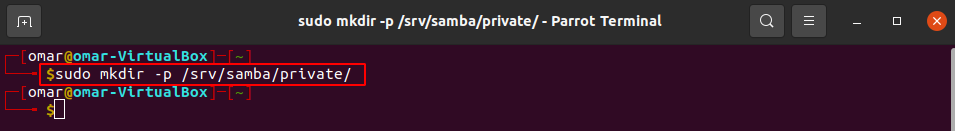

# Install and Configure Samba File Server on Ubuntu for File Sharing

## Table of Contents
- [Install and Configure Samba File Server on Ubuntu for File Sharing](#install-and-configure-samba-file-server-on-ubuntu-for-file-sharing)
  - [Table of Contents](#table-of-contents)
  - [Introduction](#introduction)
  - [How to Install Samba Server on Ubuntu](#how-to-install-samba-server-on-ubuntu)
  - [Create a Private Samba Share](#create-a-private-samba-share)
  - [Explanation:](#explanation)
  - [How to Create a Samba Public Share Without Authentication](#how-to-create-a-samba-public-share-without-authentication)
  - [Accessing Samba Shared Folder From Windows](#accessing-samba-shared-folder-from-windows)
  - [Connecting Error](#connecting-error)
  - [Accessing Samba Share Folder in Nautilus File Manager on Linux](#accessing-samba-share-folder-in-nautilus-file-manager-on-linux)
  - [Work Cited](#work-cited)

## Introduction

In this tutorial, we’re going to learn how to install and configure a Samba server on Ubuntu to share files on the local network. Samba is a free and open-source SMB/CIFS protocol implementation for Unix and Linux that allows for file and print sharing between Unix/Linux, Windows, and macOS machines in a local area network.

Samba is usually installed and run on Linux. It comprises several programs that serve different but related purposes, the most important two of which are:
* __smbd__: provides SMB/CIFS service (file sharing and printing), can also act as a Windows domain controller.
* __nmbd__: This daemon provides NetBIOS name service, listens for name-server requests. It also allows the Samba server to be found by other computers on the network.

## How to Install Samba Server on Ubuntu

* Samba is included in most Linux distributions. To install Samba on Ubuntu, simply run the following command in terminal.
**sudo apt install samba samba-common-bin** 

* To check your Samba version, run:
**smbd --version**

* To check if Samba service is running, issue the following command.
**systemctl status smbd nmbd**

* To start these two services, issue the following command:
**sudo systemctl start smbd nmbd**

* Once started, **smbd** will be listening on TCP port 139 and 445. **nmbd** will be listening on UDP port 137 and 138.

* TCP 139: used for file and printer sharing and other operations.
* TCP 445: the NetBIOS-less CIFS port.
* UDP 137: used for NetBIOS network browsing.
* UDP 138: used for NetBIOS name service.

* If you have enabled the UFW firewall on Ubuntu, then you need to open the above ports in the firewall with the following command.
**sudo ufw allow samba**

## Create a Private Samba Share

In this section, we will see how to create a private Samba share that requires the client to enter username and password in order to gain access. The main Samba configuration file is located at: /etc/samba/smb.conf. You can edit it in terminal with a command line text editor like nano:

**sudo nano /etc/samba/smb.conf**

* In the **[global]** section, make sure the value of **workgroup** is the same with the **workgroup** settings of Windows computers.

* You can find the setting on your Windows computer by going to Control Panel > System and Security > System.

* Then scroll down to the bottom of the file. (In nano text editor, you can achieve that by pressing CTRL+W then CTRL+V. ) Add a new section like below.
[Private]
comment = needs username and password to access
path = /srv/samba/private/
browseable = yes
guest ok = no
writable = yes
valid users = @samba

## Explanation:

 *   **Private** is the folder name that will be displayed on the Windows network.
 *   The comment is a description for the shared folder.
 *   The path parameter specifies the path to the shared folder. I use **/srv/samba/private/** as an example. You can also use a folder in your home directory.
 *   **browseable = yes:** Allow other computers in the network to see the Samba server and Samba share. If set to no, users have to know the name of the Samba server and then manually enter a path in the file manager to access the shared folder.
 *   **guest ok = no**: Disable guest access. In other words, you need to enter username and password on the client computer to access the shared folder.
 *   **writable = yes**: Grants both read and write permission to clients.
 *   **valid users = @samba**: Only users in the samba group are allowed to access this Samba share.

* Save and close the file. (To save the file in nano text editor, press Ctrl+O, then press Enter to confirm the file name to write. To close the file, press Ctrl+X.) Now we need to create a Samba user. First, we need to create a standard Linux user account with the following command. Replace username with your desired username.
__sudo adduser username__

* You will be prompted to set an Unix password. After that, you also need to set a separate Samba password for the new user with the following command:
**sudo smbpasswd -a username**

 
* Create the samba group.
**sudo groupadd samba**

* And add this user to the samba group.
**sudo gpasswd -a username samba**
[user-group](10.png)

* Create the private share folder.
**sudo mkdir -p /srv/samba/private/**

* The samba group needs to have read, write and execute permission on the shared folder. You can grant these permissions by executing the following command. (If your system doesn’t have the **setfacl** command, you need to install the **acl** package with **sudo apt install acl**.)
**sudo setfacl -R -m "g:samba:rwx" /srv/samba/private/**

* Next, run the following command to check if there’s syntactic errors.
**testparm**

* Now all left to do is to restart smbd and nmbd daemon.
**sudo systemctl restart smbd nmbd**

## How to Create a Samba Public Share Without Authentication

To create a public share without requiring username and password, the following conditions must be met.

* Set **security = user**  in the global section of Samba configuration file. Although you can create a public share with the security = share mode, but this security mode is deprecated. It is strongly suggested that you avoid share mode.
* Set map to **guest = bad user** in the global section of Samba configuration file. This will cause **smbd** to use a guest account to authenticate clients who don’t have registered account on the Samba server. Since it’s a guest account, Samba clients don’t need to enter password.
* Set guest **ok = yes** in the share definition to allow guest access.
* Grant read, write and execute permission of the public folder to the **nobody** account, which is the default guest account.

As a matter of fact, the first two conditions are already met as Samba by default uses these two settings.

* Here’s a step-by-step guide to create a public share. First, open and edit the Samba configuration file.
**sudo nano /etc/samba/smb.conf**

* In the [global] section, make sure the value of workgroup is the same with the workgroup settings of Windows computers.

* You can find the setting on your Windows computer by going to Control Panel > System and Security > System.

* Then scroll down to the bottom of the file and paste the following lines.

[public]
comment = public share, no need to enter username and password
path = /srv/samba/public/
browseable = yes
writable = yes
guest ok = yes

* Save and close the file. Next, create the **/srv/samba/public/** folder.
**sudo mkdir -p /srv/samba/public**

* Then make sure the nobody account has read, write and execute permission on the public folder by executing the following command. (If your system doesn’t have the setfacl command, you need to install the acl package with sudo apt install acl.)
**sudo setfacl -R -m "u:nobody:rwx" /srv/samba/public/**

* Restart smbd and nmbd.
**sudo systemctl restart smbd nmbd**

## Accessing Samba Shared Folder From Windows

* On a Windows computer that is in the same **network**, open File Explorer and click Network on the left pane.  If you see the following message, then you need to click on the message and turn on network discovery and file sharing.
**File sharing is turned off. Some network computers and devices might not be visible.**

* Next, enter \\ followed by the IP address of Samba server in the address bar of File Explorer, You will see a list of shared resources on the Samba server.

* Once connected, you can read, write and delete files in the Samba shared folder.

## Connecting Error

* If you get the following error:
**You do not have permission to access \\hostname\share-name. Contact your network administrator to request access.**

* You can try connecting to the Samba share from the command prompt. Open up a command prompt, then run the following command to close current Samba session.
**net use \\samba-server-ip\share-name /delete**
* Next, connect to the Samba share with the following command:
**net use \\samba-server-ip\share-name /user:samba-username password**
* Once the above command completed successfully, go to the Network tab in File Explorer and now you should be able to access the Samba share.

## Accessing Samba Share Folder in Nautilus File Manager on Linux

* If you are using Nautilus file manager, then click Other Locations on the left pane. On the bottom, you will see an option to connect to server. To access your Samba share, type in smb:// followed by the IP address of the Samba server and press Enter.

* You will see a list of shared resources on the Samba server.

* If you click the private shared folder, then you will need to enter the Samba username and password. If you click the public shared folder, then choose to connect as Anonymous.

## Work Cited
“Install and Configure Samba.” Ubuntu, ubuntu.com/tutorials/install-and-configure-samba#1-overview. 

Prakash, Abhishek, and About Abhishek PrakashCreator of It's FOSS. An ardent Linux user &amp; open source promoter. Huge fan of classic detective mysteries ranging from Agatha Christie and Sherlock Holmes to Detective Columbo &amp; Ellery Queen. Also a movie buff with a soft corner for. “Open Files &amp; Folders as Administrator in Nautilus File Manager.” It's FOSS, 8 July 2020, itsfoss.com/open-nautilus-as-administrator/. 

“How to Install and Configure Samba File Sharing Server in Ubuntu (Password Authentication).” YouTube, YouTube, 5 Mar. 2020, www.youtube.com/watch?v=aoILd78zZE4. 

“Install and Configure Samba Server on Ubuntu for File Sharing.” LinuxBabe, 1 Apr. 2021, www.linuxbabe.com/ubuntu/install-samba-server-file-share. 

