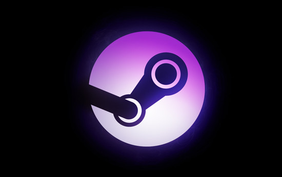

# Scenario 1: Using a Live Linux Installation
Logo | Based on | URL
---- | -------- | ---
| Arch | https://archbang.org/ 
ArchBang is an Arch-based Linux distribution. It features the light-weight openbox window manager, conky and a simplified installation process. It includes the power and flexibility of Arch Linux without the complex setup and installation. ArchBang works on i686 or X86_64 compatible machines, uses 700MB of disk space, and requires just 256MB of memory.

# Scenario 2: Using Linux for parental control
Logo | Based on | URL
---- | -------- | ---
 | Debian (Stable) | https://academixproject.com 
AcademiX is a Debian based Linux distribution designed explicitly for education purposes. It comes bundled with free, open-source teaching and learning software to use for primary education to the university level. The EDU package manager provides you with one large pool where you can find and install all the educational software you might need.I would use Firefox as the web browser and I will add the FoxFilter; FoxFilter helps block content for essentially any user-defined Web site or criteria. You can quickly and easily block content for an entire site. FireFilter OpenDNS offers a free version. Their 'deluxe' version is $9.95 per year, so that is not free, but it is a great price.

# Scenario 3: Linux + Gaming
Logo | Based on | URL
---- | -------- | ---
 | Debian (Stable) | http://store.steampowered.com/steamos/
Steam has its own livestreaming feature. Steam broadcast is a robust, built-in video-encoding software that not only allows you to stream footage with friends, but to anyone with a link. In-Home Streaming works good on SteamOS / Linux and supports DirectX 9, 10, and 11 games plus regular desktop applications as well, such as the Microsoft Edge web browser. You can also install PlayOnLinux software for Wine gaming on SteamOS.

# Scenario 4: Reviving an old PC
Logo | Based on | URL
---- | -------- | ---
 | Debian, Ubuntu | http://www.xubuntu.org/
You will find it easy to use and can also install it on your older computers with no issues. Xubuntu is a community-developed operating system based on Ubuntu. It comes with Xfce, which is a stable, light and configurable desktop environment.
