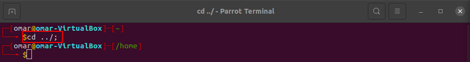

1. Explain the difference between absolute path and relative path?
A path is either relative or absolute. An absolute path always contains the root element and the complete directory list required to locate the file. ... A relative path needs to be combined with another path in order to access a file.

2. Why Linux uses / instead of \ for its directory paths?
Because Linux uses UNIX traditions which is why it uses the forward slash instead of the backslash.

3. In Windows, these files are all the same: File FILE file and FiLE. But in Linux this is not the case, Why?
Because Linux cares about capitalization. While they are all named file, they all use different capitalization
and Linux allows this because technically they are not named exactly the same.

4. What is the Filesystem Hierarchy Standard (FHS) and who maintains it?
The Filesystem Hierarchy Standard (FHS) defines the directory structure and directory contents in Linux distributions. It is maintained by the Linux Foundation.

5. Explain what type of files are stored in the following directories:

Directory | What is it used for?
--------- | --------------------
/bin | binaries is another word for programs like Ls, cat and other basic functions
/dev | this is where the devices live. It contains hardware like disk which would be dev/sda
/etc | etcetera, it is where all configurations are stored; such as apt
/home | is where you store your personal files and documents
/lib | libraries, libraries are files that applications can use to perform various functions
/opt | optional folder where manually installed software from vendors resides 
/tmp | temporary directory, where files are temporarily stored by applications that could be used during a session
/var | variable directory, it contains files and directories that are expected to grow in size
/proc | prop rock is where you find pseudo file that contain information about system process and resources
/usr | user applications space where applications will be installed by the user

6. How does a period at the beginning of a file name means (example .bashrc)?
it means that it is hidden

7. Which command would you use to list all the files inside the /usr/share/ directory?
ls /usr/share/

8. If you are working in the /usr/share/icons directory and want to move to your home directory, which command would you use?
cd

9.  Explain what these commands do:
cd .config/.htop; cd ../; ls -lX

The cd (“change directory”) command is used to change the current working directory

cd ../; command is used to change the current working directory to /home directory

cd ../; ls -lX change the current working directory to /home directory and long list the home directory sorted alphabetically by entry extension

10. John has a lot of files in the directory /var/www/html/webapp. He wants to long list all the files, including hidden files, by modification time (newest first), and with human-readable file sizes. Which command should he use conjuring that his current working directory is:
**/home/john/.git/**

* First, he should use cd to go back to home directory.
* Then install apache2 : sudo apt install -y.
* Change directory to /var/www/html/webapp.
* Then long listed with ls command using -lah option.

