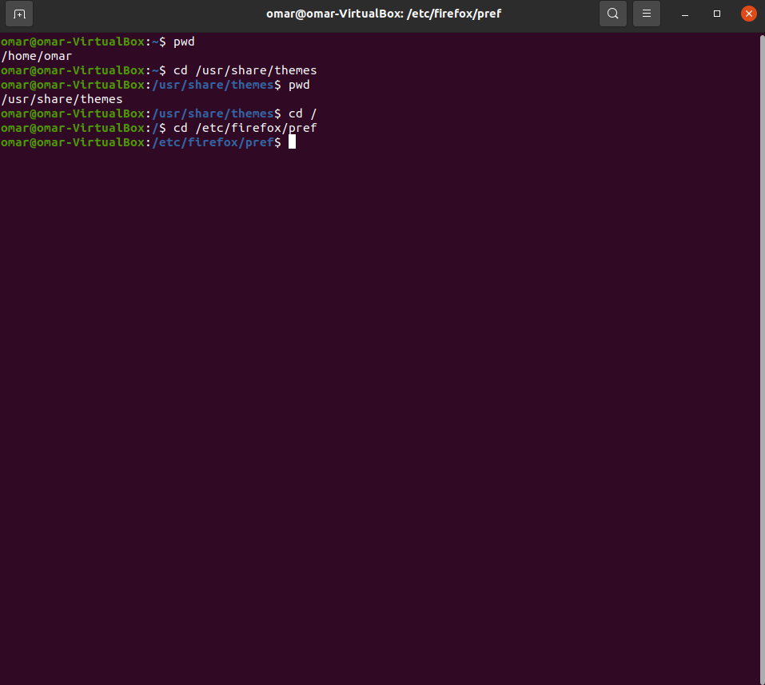

# Lab 3 | Installing software and navigating the file system | Answers
Assignment description [here](https://raw.githubusercontent.com/ra559/cis106/main/labs/lab3.md)

## Question 1
1. Which command did you use to search for the themes and to install them?
apt search 'gtk theme'
sudo apt install breeze-gtk-theme
2. Which commands did you use to find and install the web browser?
apt search gtk 'web browser'
sudo apt install epiphany-browser
3. Use the command line to find a 3D or 2D racing game. Answer the following questions about the game:
3.1 What is the name of the package?
trigger-rally-data
3.2 What dependencies are needed in order to install the package? (you can either take a screenshot of the terminal or copy and paste from the terminal)
The following packages were automatically installed and are no longer required:
  apport-symptoms guile-2.2-libs libevent-2.1-7 libgc1c2 libgnome-games-support-1-3
  libgnome-games-support-common libnatpmp1 libqqwing2v5 python3-systemd
Use 'sudo apt autoremove' to remove them.
The following additional packages will be installed:
  libalut0 libglew2.1 libphysfs1 libsdl2-image-2.0-0 libtinyxml2-6a trigger-rally
Suggested packages:
  glew-utils
The following NEW packages will be installed:
  libalut0 libglew2.1 libphysfs1 libsdl2-image-2.0-0 libtinyxml2-6a trigger-rally trigger-rally-data
0 upgraded, 7 newly installed, 0 to remove and 19 not upgraded.
Need to get 119 MB of archives.
3.3 How much disk space will the package utilize after installation?
126 MB 
 

## Question 2

.png)

## Question 3

## Question 4

## Question 5