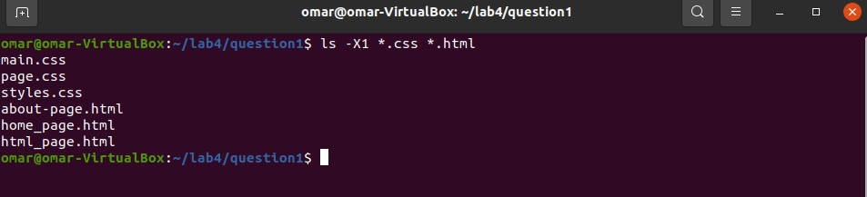
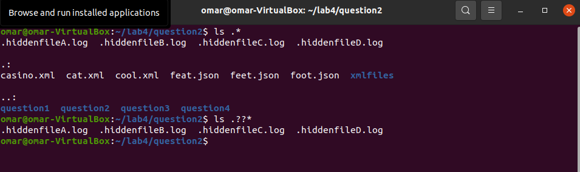

Lab 4.2 | File Globing/wildcards

Question 1 | Using the * Wildcard

Problem 1:

Problem 2:

Problem 3:

Problem 4:

Problem 5:

Question 2 | Using the ? wildcard

Problem 1:

Problem 2:

Problem 3:

Problem 4:

Question 3 | Using the [] Wildcard

Question 4 | Using brace expansion.

Problem 1:

Problem 2:

Problem 3:

Problem 4:

Problem 5:

