Lab 4 | Managing files and directories
IMPORTANT - READ ME

Lab video here

    You have to complete labs 0, 1, 2, and 3 before attempting lab 4.
    If you are using the Cloud environment (Apporto), Make sure that you have complete the Setup per this video before doing this lab.
    Managing files and directories
    All the questions in this lab will be in your midterm.
    Questions 1 - 4 are worth 25 points
    Questions 5 does not require a submission.

Question 1: Creating Files and Directories
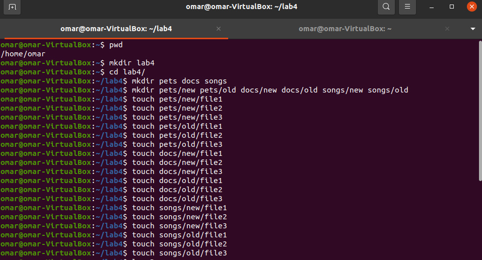
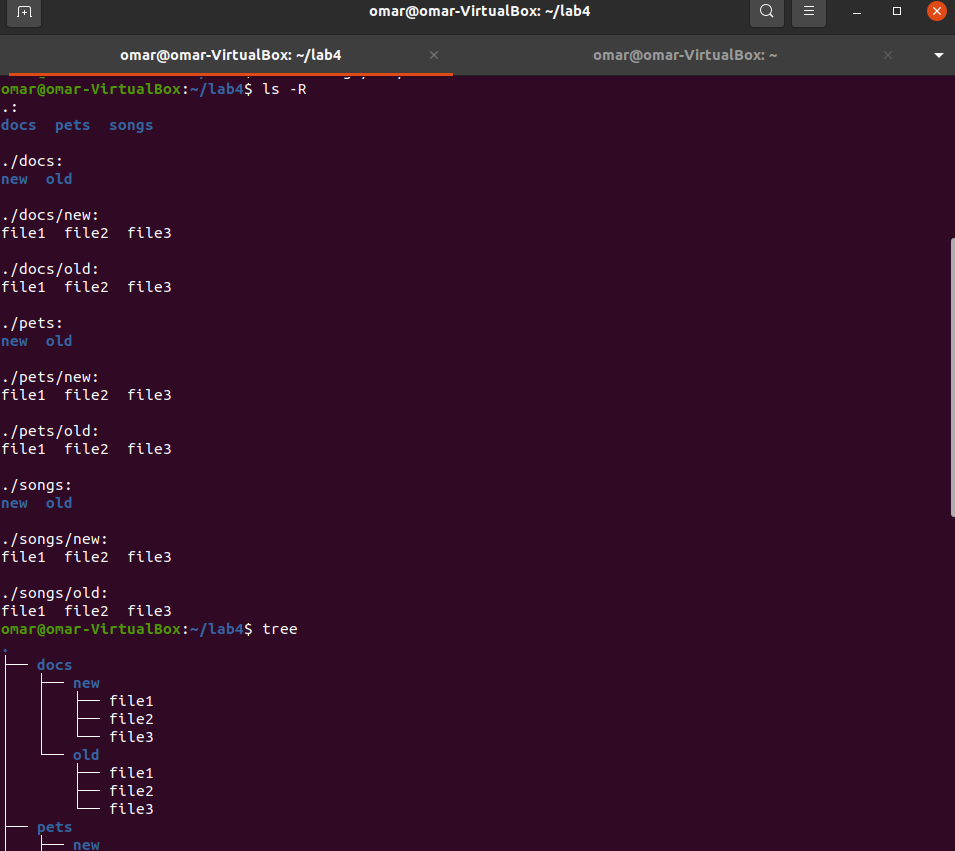
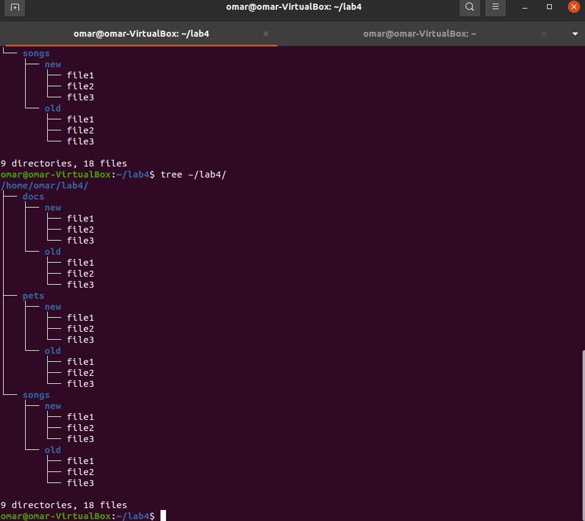

   

Question 2: Removing Files and Directories
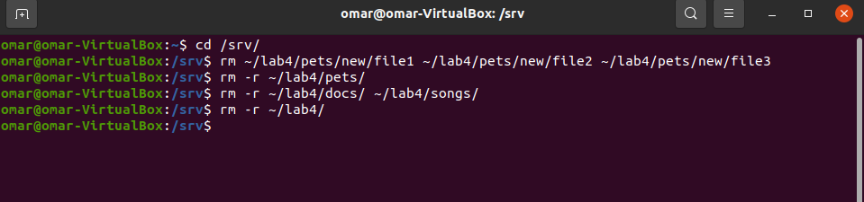

Question 3: Moving Files and Directories
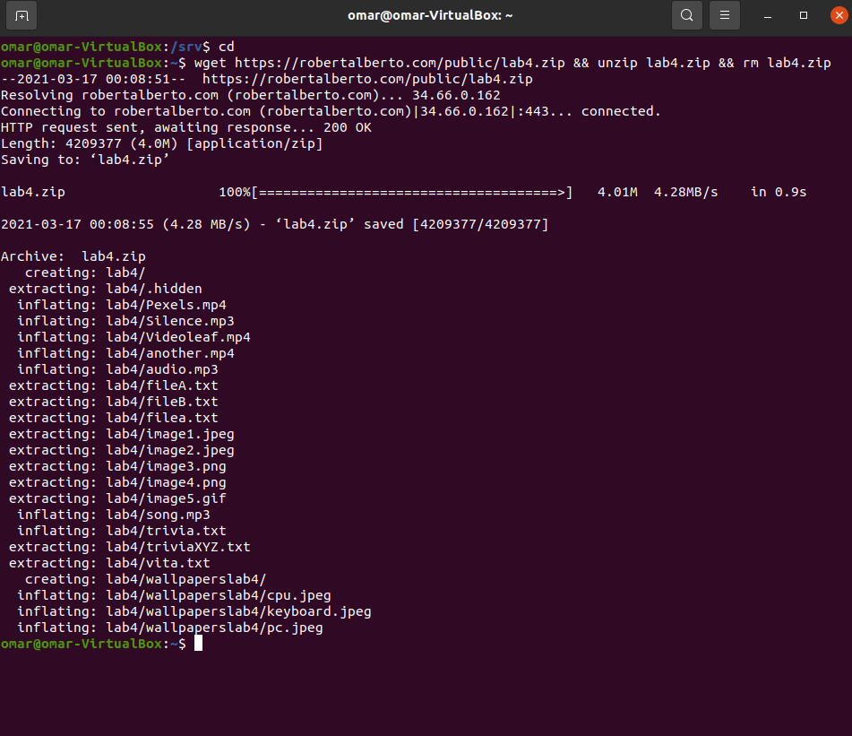
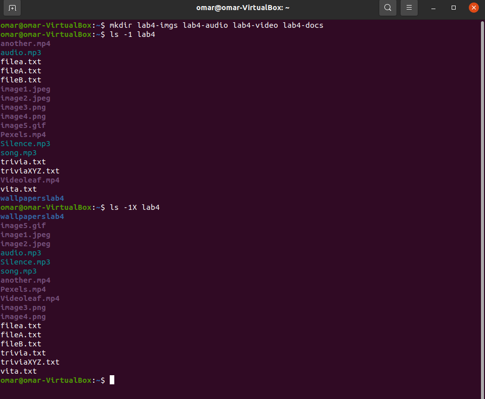
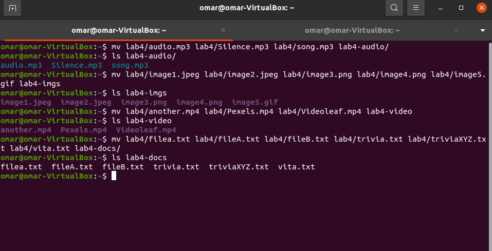
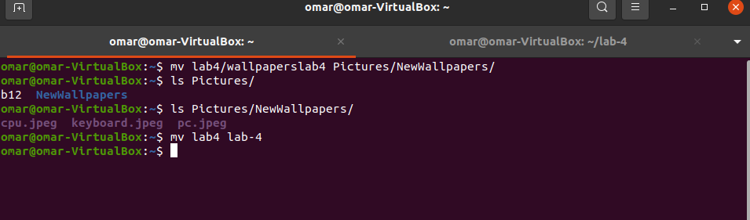
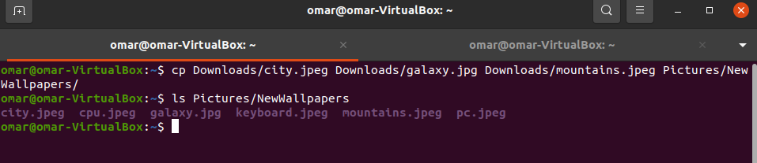

Question 4: Copying Files and Directories
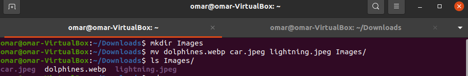
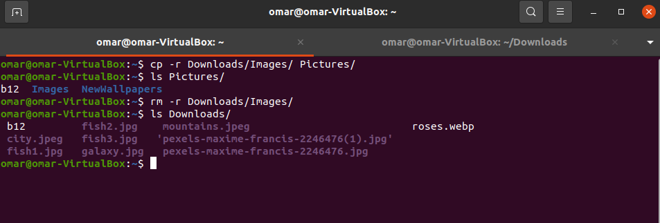

 
