# Question 1 | Tar Utility

## 1,2 
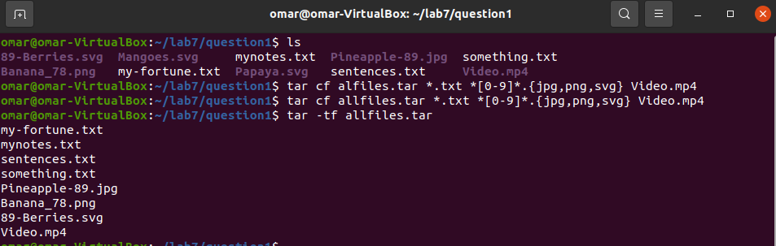

## 3.
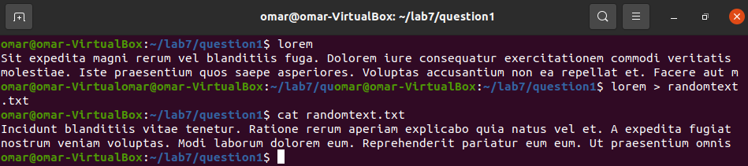

## 4,5
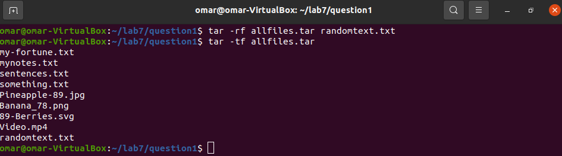

# Question 2 | Cpio Utility

## 1,2
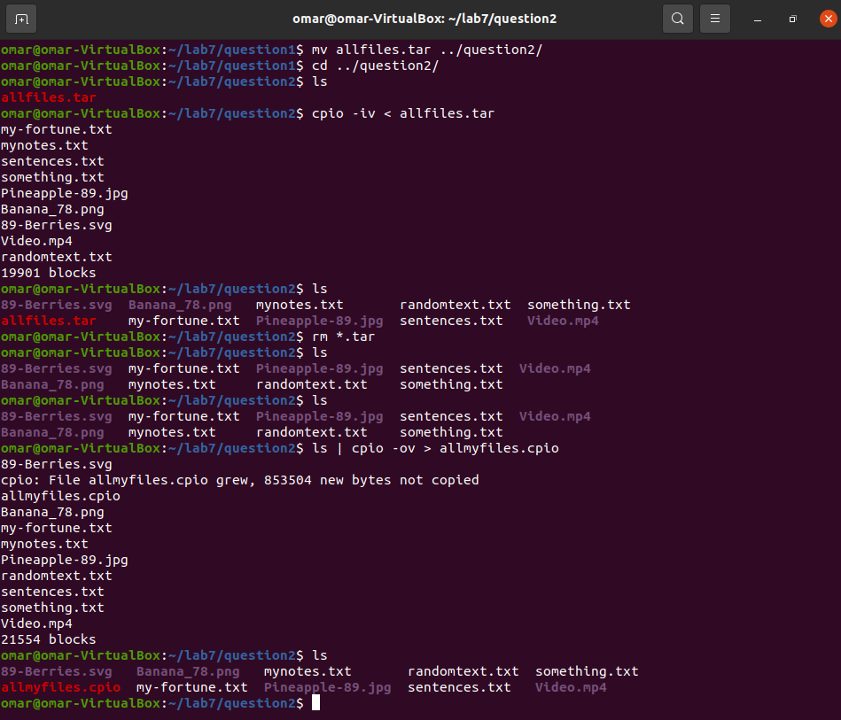

## 3.
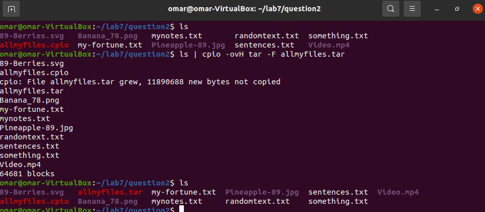

## 4.
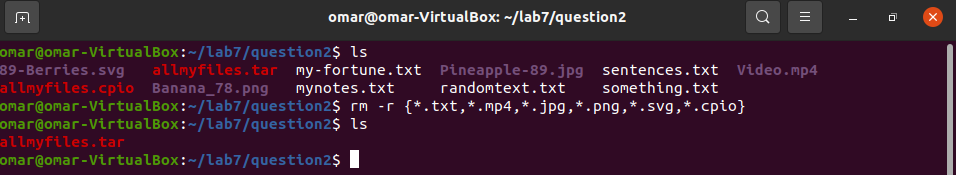

## 5.
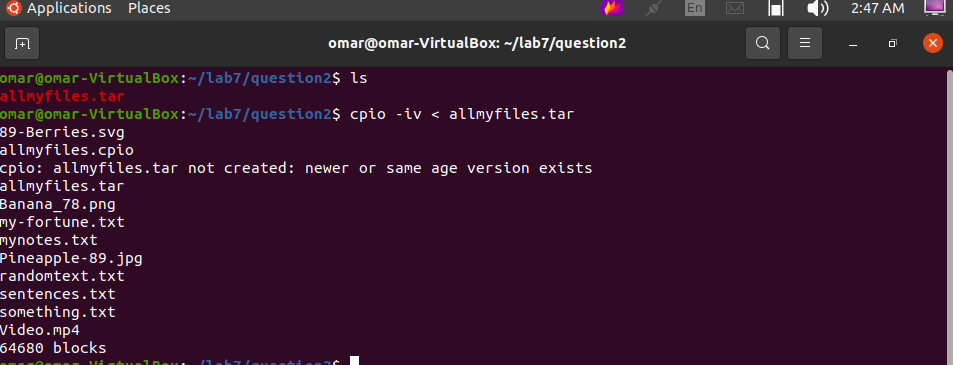

# Question 3 | Gzip, bzip2, xz

## 1.
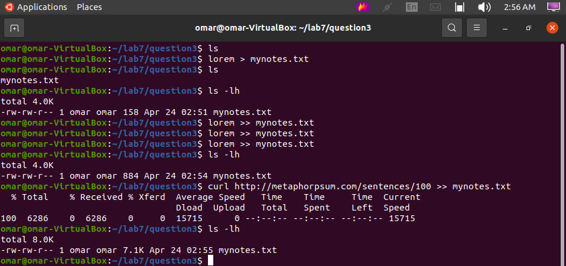

## 2,3,4,5
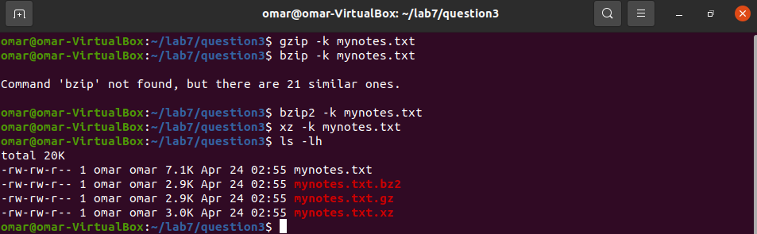

# Question 4 | Zip, 7zip and Rar

## 1.
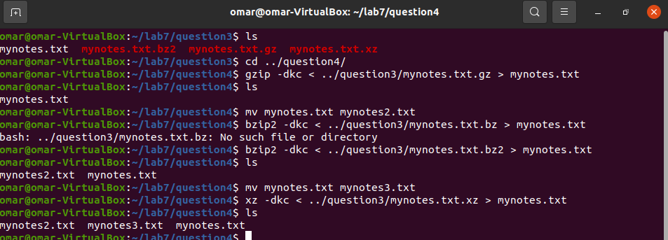

## 2,3
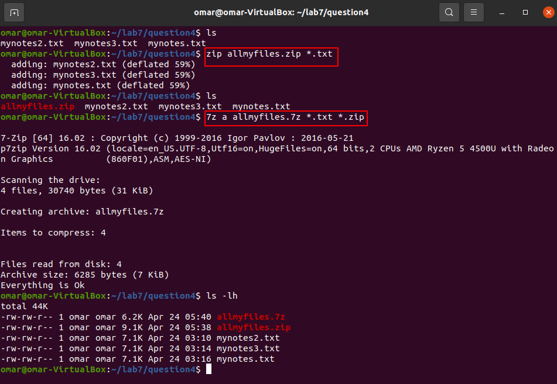

## 4,5
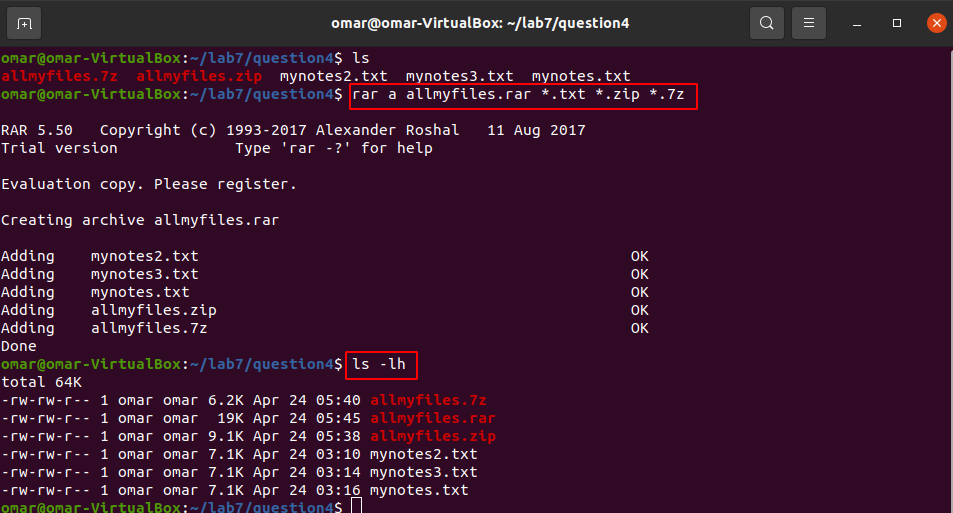
