# Final Notes 

## Table of Contents
- [Final Notes](#final-notes)
  - [Table of Contents](#table-of-contents)
- [Notes Lecture 1 What is Linux](#notes-lecture-1-what-is-linux)
  - [Why Do you need to learn linux?](#why-do-you-need-to-learn-linux)
  - [What is Linux?](#what-is-linux)
  - [Linux books I can use:](#linux-books-i-can-use)
  - [Linux distributions](#linux-distributions)
  - [Linux Architecture](#linux-architecture)
  - [Software licensing agreement](#software-licensing-agreement)
  - [Advantages/Disadvantages of Open Source software](#advantagesdisadvantages-of-open-source-software)
  - [What is Ubuntu?](#what-is-ubuntu)
- [Notes Lecture 02 | Installing Ubuntu](#notes-lecture-02--installing-ubuntu)
  - [What is Virtualization?](#what-is-virtualization)
  - [Installing Ubuntu In a virtual machine](#installing-ubuntu-in-a-virtual-machine)
- [Notes Lecture 03 | Learning the Bash Shell](#notes-lecture-03--learning-the-bash-shell)
  - [Exploring Desktop Environments](#exploring-desktop-environments)
  - [What is a shell?](#what-is-a-shell)
  - [Managing Software](#managing-software)
  - [The Linux Filesystem](#the-linux-filesystem)
- [Notes Lecture 04 | Manipulating files and directories](#notes-lecture-04--manipulating-files-and-directories)
  - [Managing files and directories](#managing-files-and-directories)
    - [Creating directories](#creating-directories)
    - [Creating files](#creating-files)
    - [Deleting files and directories](#deleting-files-and-directories)
    - [Moving files and directories](#moving-files-and-directories)
    - [Copying files and directories](#copying-files-and-directories)
  - [Working with links](#working-with-links)
    - [Inodes (index files)](#inodes-index-files)
    - [Hard links](#hard-links)
    - [Soft links](#soft-links)
  - [Getting help](#getting-help)
  - [Using Wildcards](#using-wildcards)
  - [Using brace expansion](#using-brace-expansion)
- [Notes Lecture 05 | Command Line text editors](#notes-lecture-05--command-line-text-editors)
  - [Handling text files](#handling-text-files)
    - [cat command](#cat-command)
    - [tac command](#tac-command)
    - [head command](#head-command)
    - [tail command](#tail-command)
    - [cut command](#cut-command)
    - [sort command](#sort-command)
    - [grep command](#grep-command)
  - [Redirection](#redirection)
    - [Redirecting stdout and stderr](#redirecting-stdout-and-stderr)
    - [The pip (|)](#the-pip-)
  - [Text Editors](#text-editors)
    - [NANO](#nano)
    - [VIM](#vim)
- [Notes Lecture 06 | Managing Data and File permissions](#notes-lecture-06--managing-data-and-file-permissions)
  - [Managing Data](#managing-data)
    - [Basic Terminology](#basic-terminology)
    - [Archiving Utilities](#archiving-utilities)
    - [tar command](#tar-command)
    - [cpio command](#cpio-command)
    - [File Compression](#file-compression)
  - [File permissions](#file-permissions)

# Notes Lecture 1 What is Linux

## Why Do you need to learn linux?
* Linux runs in a lot of devices. Example: laptops, desktops, servers, smartphones, IoT devices, etc
* Linux powers the cloud
* Linux is used by a lot of companies even Microsoft
## What is Linux?
* Linux is a kernel. A kernel is the core of any operating system.
* An operating system that uses the Linux kernel is called a Linux Distribution. Example: Ubuntu and Android.
* Linux is multitasking, multi-user, and multipurpose OS.
* Linux is a modular operating system.
## Linux books I can use:
* Linux Administration A Beginner's Guide 8th Edition by Wale Soyinka
* CompTia Linux+ Study Guide by  Christine Bresnahan
* The Linux Command Line by William Shotts

## Linux distributions

* There are a large number of Linux distributions.
* There are two main Linux Distributions:
  * Debian
  * Redhat
* There are also other independent distributions:
  * Slackware
  * Arch
  * Gentoo

## Linux Architecture

* Linux is modular which means that users can remove and add/remove whatever they need or don't need.
    * **Kernel** =  the core of the operating system. Manages the hardware.
    * **Daemons** =  background programs that run independent of the user.
    * **Shells​** = the interface that accepts user input and translates it so that the kernel can use it.
    * **Graphical Desktop Environmen​t** = a collection of software that makes the graphical interface.
* In Linux everything is a file.
* Type of files:
  * Device files
  * Directory files
  * Binary files
  * Regular files
## Software licensing agreement
* A license agreement outlines the rights a user has to a given software
* Types of licensing agreement:

Open source | Closed source | Free software
------------|---------------|--------------
Software can be distributed for free or a fee. **The source code must be distributed with the software.** | software can be distributed for free or a fee. ​**The end user has limited access to the software and the source code is not available.** | Software can be distributed for free or a fee. The user has total control of the software and the source code.The software must comply with the 4freedoms.

**The 4 freedoms**
* Freedom 0: the user can run the program as you wish, for any purpose .
* Freedom 1: the user can  study how the program works, and change it.
* Freedom 2: the user can  redistribute copies.
* Freedom 3: the user can distribute copies of your modified versions.
**Learn more:​** https://www.gnu.org/philosophy/free-sw.en.html

## Advantages/Disadvantages of Open Source software

## What is Ubuntu?
* Ubuntu is a complete Linux operating system.
* It is free with community and professional support and available for both desktop and server use. 
* Ubuntu includes many pieces of software like Linux kernel version 5.4 and GNOME 3.28.

# Notes Lecture 02 | Installing Ubuntu

## What is Virtualization?

Virtualization is a kind of make-believe computers that runs the limited resources computers. It is the process that allows you to create a software based representation of something. It is like having more than one computer(many operating systems)on one machine.

## Installing Ubuntu In a virtual machine

1. Choose a descriptive name and a destination folder for the new virtual machine
2. Memory size: ubuntu requires at least 2GB of RAM
3. Hard disk -> create a virtual hard disk -> VDI type -> dynamically allocated (will use space in your hard drive)
4. File size: 50GB
5. Setting: General: advanced: shared clipboard and drag n drop are set to bidirectional.
6. Description: input the username and password information.
7. Base memory: 2MB
8. Processor: 2CPU
9. Display: 128MB for video memory
10. Download ubuntu from the storage
11. Follow the wizard to complete installation
12. Update ubuntu:
**Sudo apt update; sudo apt upgrade -y; sudo apt full upgrade -y**
13. Install Guest Additions. 
 
 # Notes Lecture 03 | Learning the Bash Shell

## Exploring Desktop Environments
1.  A desktop environment is the bundle of components that provide you common graphical user interface (GUI) elements such as icons, toolbars,wallpapers. Your laptop is going to operate faster and more functionally if the desktop environment has less flashy effects.
   
2. Functionality is always more important than the flashy effects.
   
3. A graphical user interface (GUI) is a type of user interface through which users interact with electronic devices via visual indicator representations.
   
4. Windows and MacOS’s users are limited to one single DE and GUI unlike linux’s users which have plenty of options to their DE and GUI.
   
   * a. Desktop settings: Programs that allow you to make configuration changes to your desktop environment.
   * b. Display manager = Login screen
   * c. File manager: allows user to perform maintenance activities graphically.
   * d. Icons: how files and programs pictured
   * e. Favorite bar: window bar for popular icons and the ones that are used frequently.
   * f. Launcher: program that allows user to search for applications and files.
   * g. Menus
   * h. A panel is an area in your desktop environment from which you can run applications and applets, and perform other tasks
   * i. A system tray is usually attached to a panel; it allows access to programs which allow users to logout, lock screen, view notifications.
   * j. Widgets represents virtual things on desktop, Clock, Sticky notes,weather, Calculator, Calendar…
   * k. Window manager: is a powerful program that tells the computer what to do with the window. 
5. **The GNOME DE:**
It is a desktop environment that is default for ubuntu. It is used for Unix like operating systems. The official GUI for GNOME is called GNOME shell.

6. **The KDE desktop environment:**
The Cool Desktop Environment’s first release was 1998. In 2009 it was branded to become KDE PLASMA.

7. **The XFCE desktop environment:**
XFCE (which was very heavy) is a free and open-source desktop environment for Linux. XFCE is lightweight and fast, it is at the same time user friendly and appealing.
**Ubuntu** is a bit easier to use when it's first installed, but Manjaro's smaller overhead allows for a speedier system and more granular control.

8. **Mate desktop environment:**
It is the best desktop environment for raspberry pi. It is a continuation for GNOME 2.

9. **The Cinnamon desktop environment:** 
Cinnamon is a desktop environment which combines a traditional desktop layout with modern graphical effects. The underlying technology was forked from the GNOME desktop. Cinnamon is the best desktop environment for Windows 10.

10. **Lubuntu:**
Very fast and light weight; it is not featureless.

##  What is a shell?
shell is a program that takes commands from the keyboard and gives them to the operating system to perform.
* That shell allows the user to give external and internal commands
* The default shell in most linux distributions is the bash shell

## Managing Software
* To update any Debian distro: **Sudo apt update;Sudo apt upgrade-y**
  * Sudo:it allows you to run any command 
  * apt : manages software and update to run multiple commands use;
  * -y is used to pass a yes answer to any question
  
* How to install several programs in a single command: **Sudo apt install firefox flameshot caffeine -y**
  
* How to remove several programs ina single command: **Sudo apt remove firefox flameshot caffeine -y**
  
* How to install and remove programs install single command: **Sudo apt install firefox+ flameshot-caffeine-vlc+**

* How to search for all programs that matches the text in quotes: **apt search “web browser”**
  
* How to remove programs and all remaining traces: **Sudo apt purge firefox+ flameshot-caffeine-vlc+**

## The Linux Filesystem 

* **Some commands that need to be mastered :**
  * pwd : displays the present working directory
  * cd : change your working directory
  * to go to home directory:
    cd
    cd ~
    cd $HOME
  * two periods mean cd ../ the previous working directory one way back     
  * two way back cd ../../ we can also go the root of the file system
  * one period mean cd ./ the present working directory
  * Arrow keys to up and down to go back to the commands that you typed
  * Cat .bash_history : this command will open a list of all the commands that you typed in the shell

* **Ls command to list the files and directories**
    * Ls downloads to show what is inside downloads
    * Ls -a :to list all the files including the hidden in your pwd
    * Ls -R :to list all the files recursively in your pwd
    * Ls -a ~/Downloads: to list all the files in a given directory
    * Ls -la is for long listing
    * Ls -t : lists files by last date modified
    * Ls -S : lists files by size
    * Ls -X :lists files by extension
    * Ls –help : lists all the options of the ls command

* **Important Link for Linux Commands** 
  * [Linux Commands](https://robertalberto.com/linuxcommands/home.html)

# Notes Lecture 04 | Manipulating files and directories

## Managing files and directories

### Creating directories

### Creating files

### Deleting files and directories

### Moving files and directories

### Copying files and directories

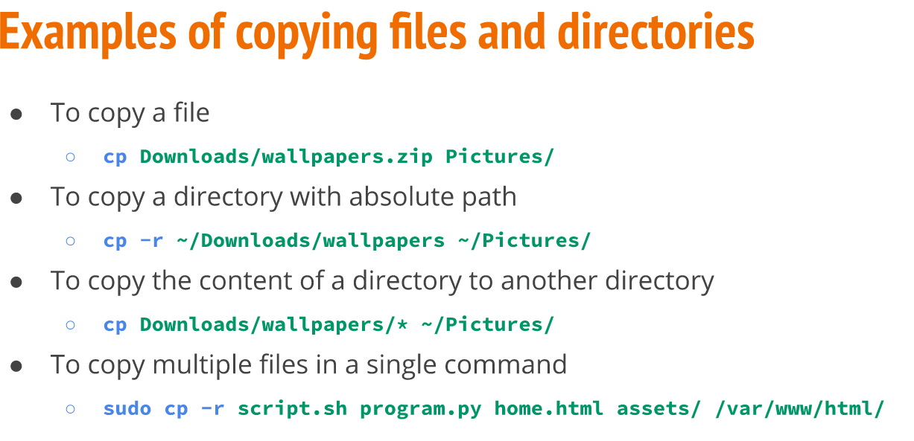

## Working with links

### Inodes (index files)

### Hard links

### Soft links

## Getting help 

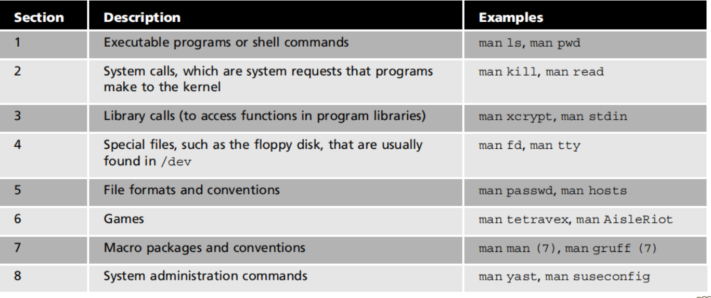

## Using Wildcards

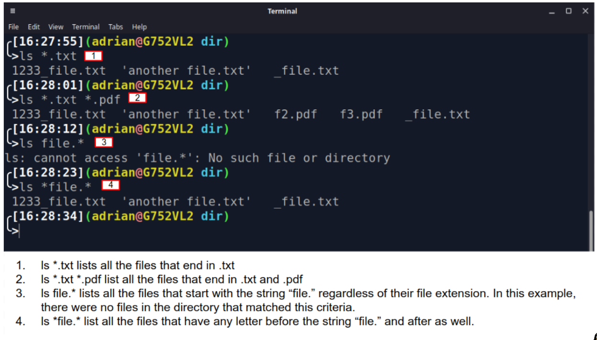

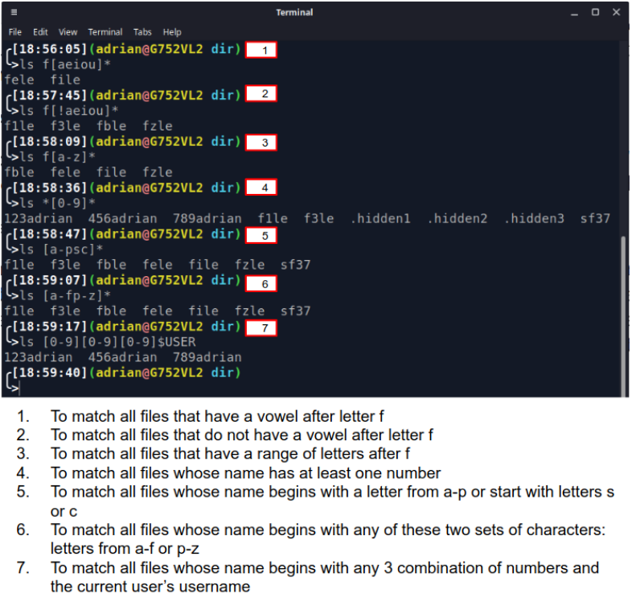

## Using brace expansion

# Notes Lecture 05 | Command Line text editors

## Handling text files

### cat command

### tac command

### head command

### tail command

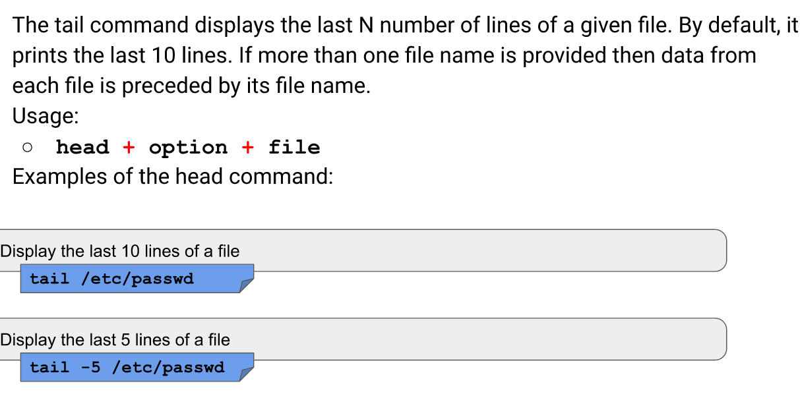

### cut command

### sort command

### grep command

## Redirection

### Redirecting stdout and stderr

### The pip (|)

## Text Editors

### NANO

Nano is a simple, modeless, WYSIWYG command-line text editor included in most Linux installations. With a simple easy to use interface, it is a great choice for Linux beginners.

* Install Nano on Ubuntu
**sudo apt install nano**

* To open an existing file or to create a new file, type nano followed by the file name:
__nano filename__

### VIM

* what is VIM

* How to start and quit vim?

* Vim practice

* Vim cheat sheet
https://vim.rtorr.com/

# Notes Lecture 06 | Managing Data and File permissions

## Managing Data

### Basic Terminology

### Archiving Utilities

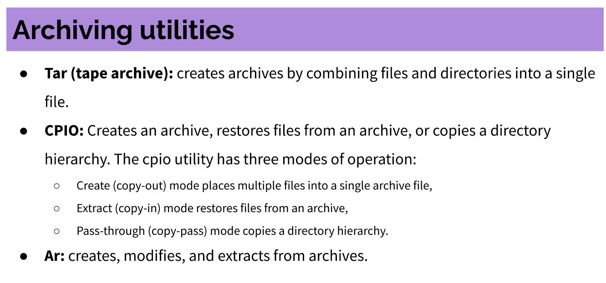

### tar command

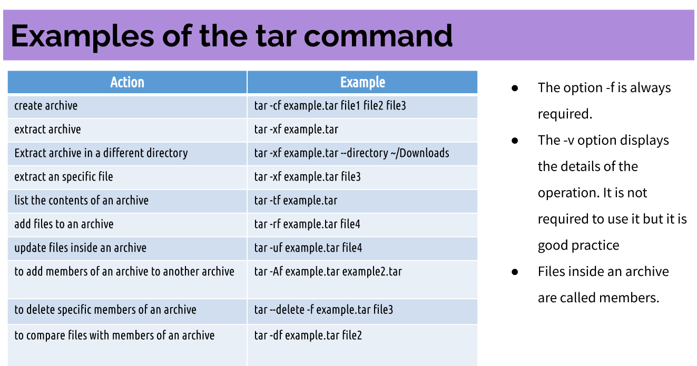

### cpio command

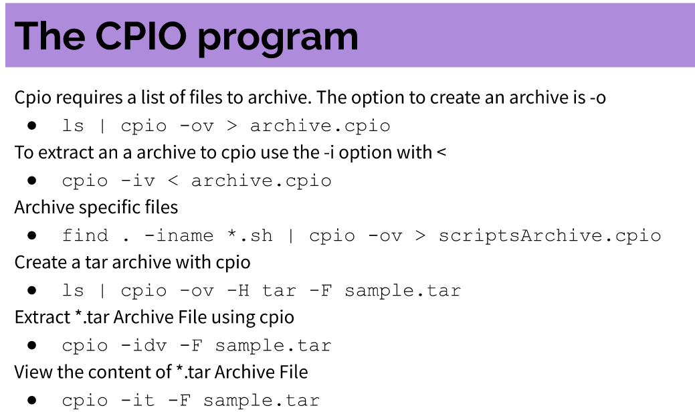

### File Compression

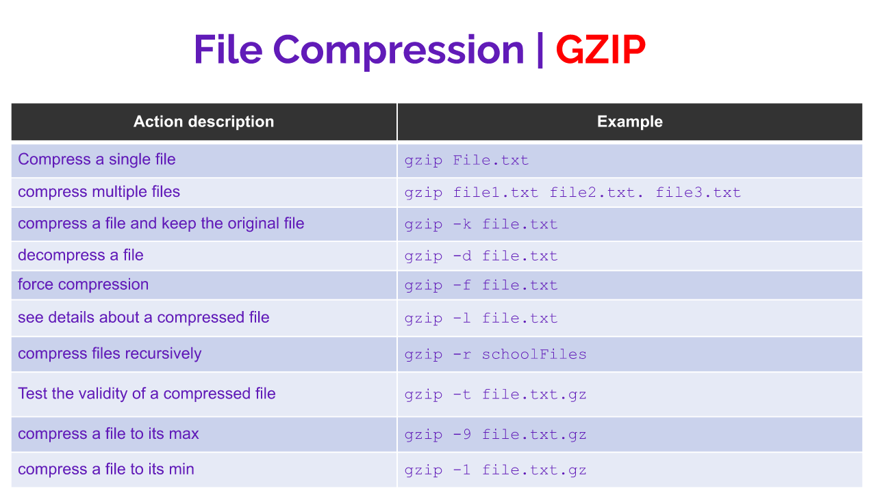

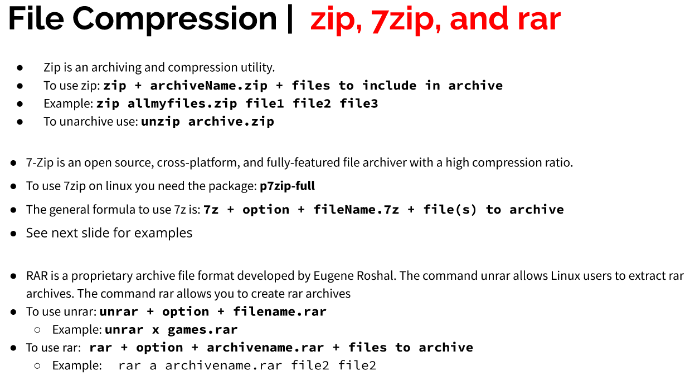

## File permissions

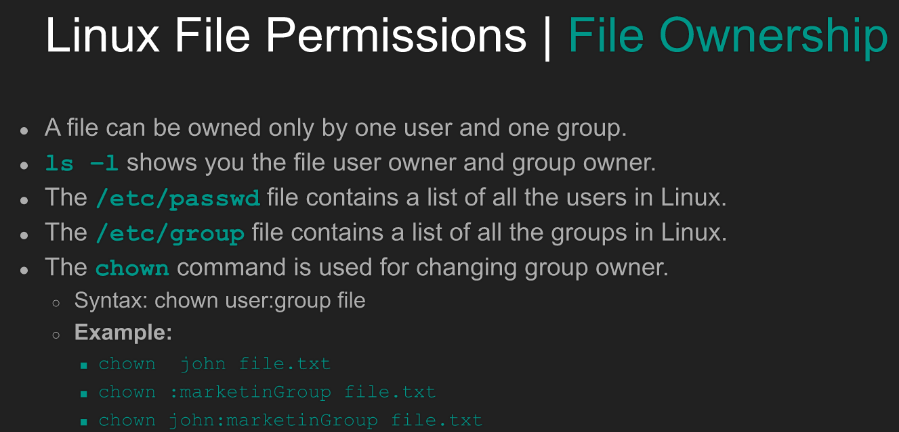

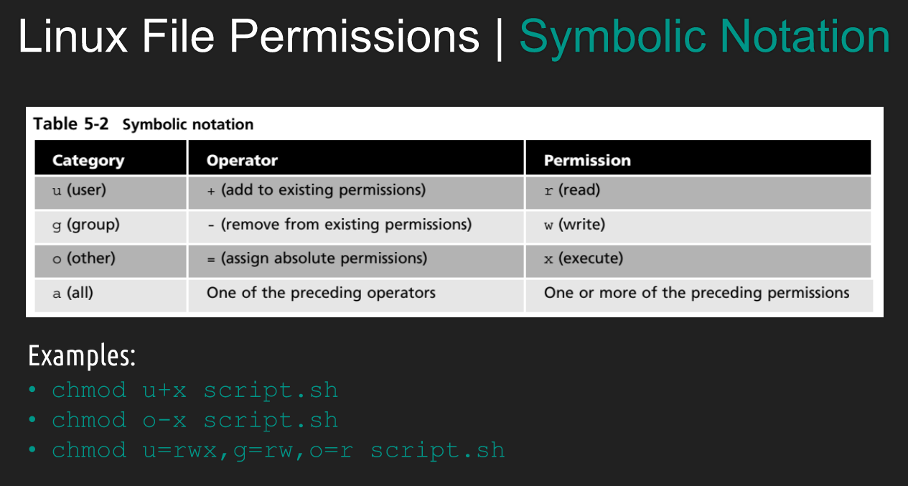

