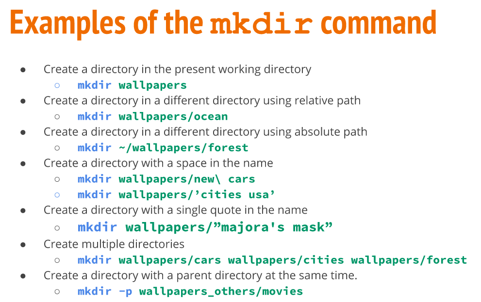
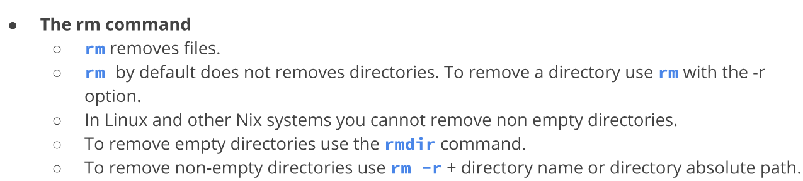
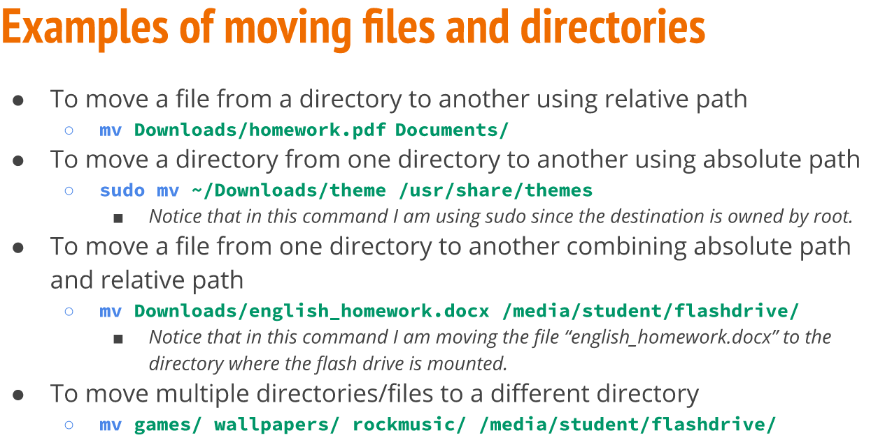
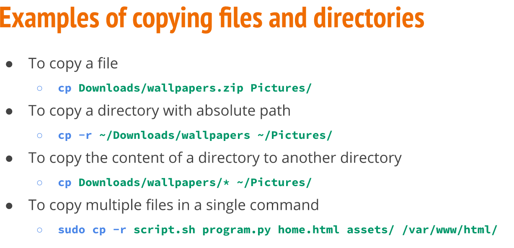
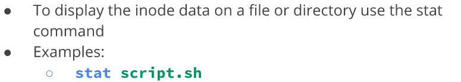
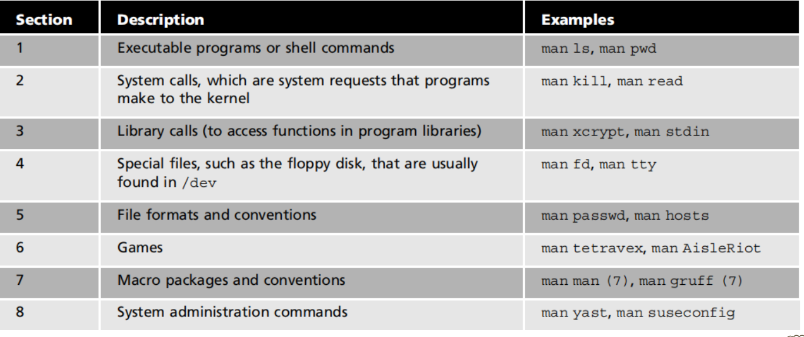
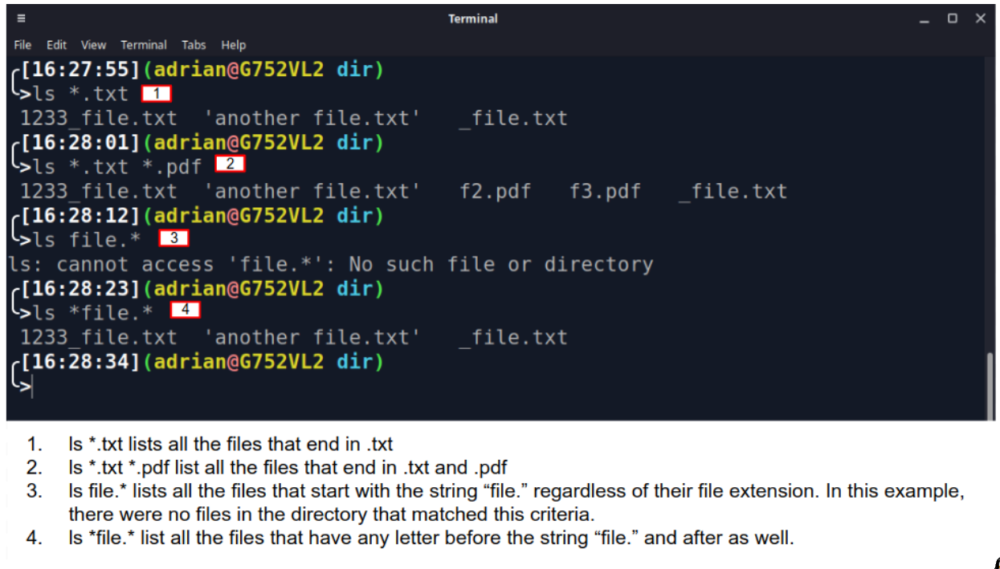
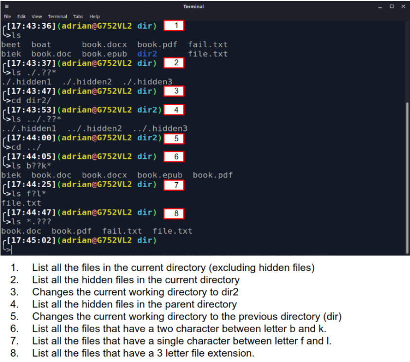
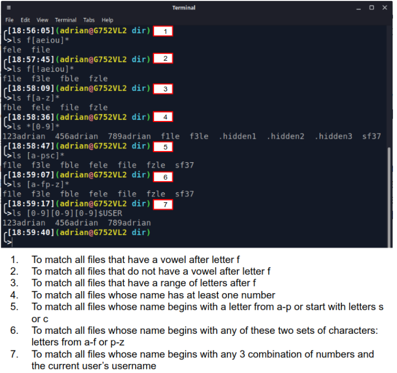
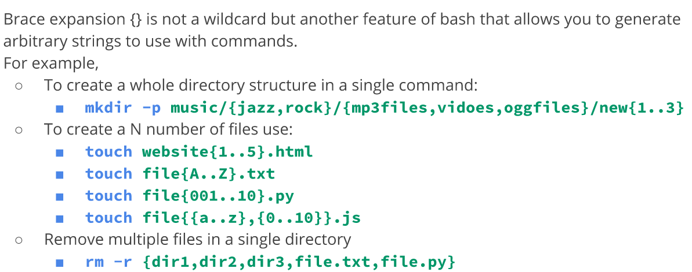

# Managing files and directories

## Creating directories

## Creating files

## Deleting files and directories

## Moving files and directories

## Copying files and directories

# Working with links

## Inodes (index files)

## Hard links

## Soft links

# Getting help 

# Using Wildcards

# Using brace expansion

