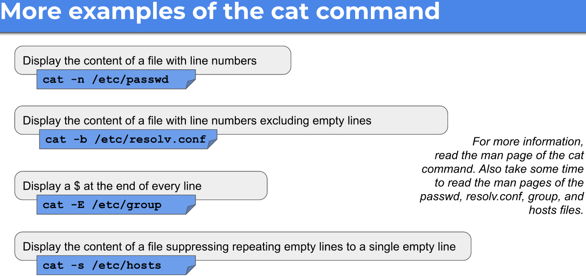
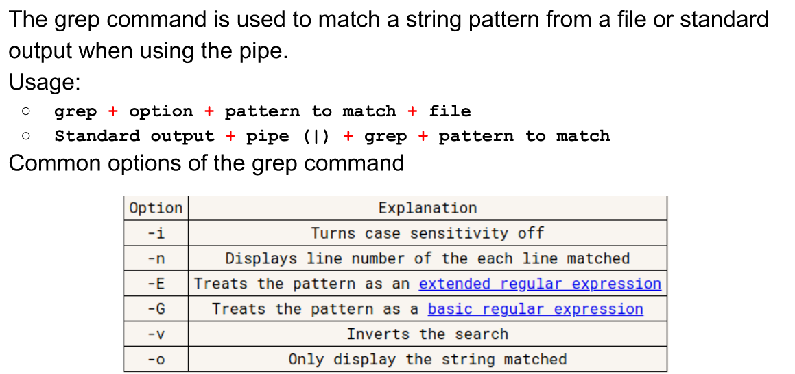
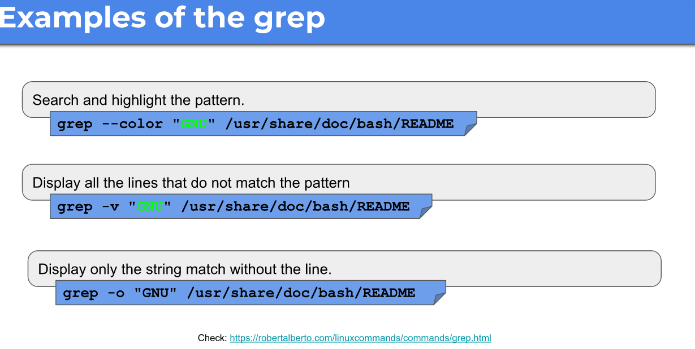
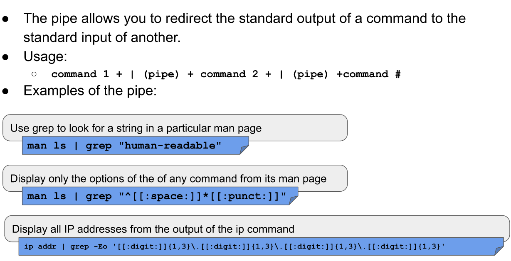
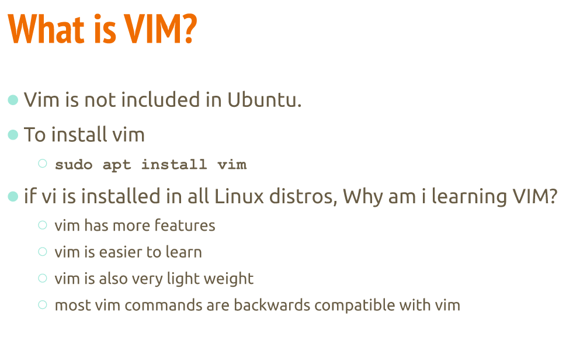
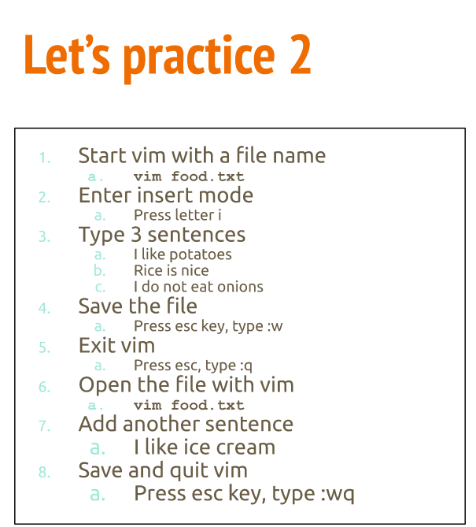

# Handling text files

## cat command

## tac command

## head command

## tail command

## cut command

## sort command

## grep command

# Redirection

## Redirecting stdout and stderr

## The pip (|)

# Text Editors

## NANO

Nano is a simple, modeless, WYSIWYG command-line text editor included in most Linux installations. With a simple easy to use interface, it is a great choice for Linux beginners.

* Install Nano on Ubuntu
**sudo apt install nano**

* To open an existing file or to create a new file, type nano followed by the file name:
__nano filename__

## VIM

* what is VIM

* How to start and quit vim?

* Vim practice

* Vim cheat sheet
https://vim.rtorr.com/

